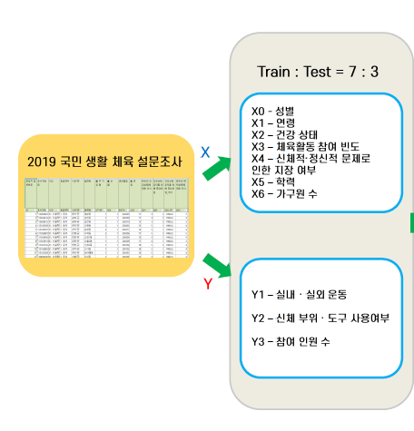

# Sports-center-locations-and-events-Recommendation
## 프로젝트명_ 공공생활체육시설 입지 선정 및 종목 추천

> 집 앞 5분 거리 생활체육환경 조성을 목표

## 프로젝트 목표

### 양적 분석

> 구별 생활체육시설까지의 평균 접근거리를 개선하기 위한 최적입지 학교 선정
>
### 질적 분석

> 동 별 주민들의 선호체육종목을 분석하여 추천

## 개발 환경

- python 3.7.7
- QGIS

## 사용 라이브러리

- **Scientific Computation**

  - pandas

  - numpy
  
    

- **General DL/ML library/framework**

  - sklearn.preprocessing
  
  - sklearn.model_selection
  
  - sklearn.neural_network
  
  - sklearn.ensemble

- **Visualization/Interactive**

  - seaborn

  - matplotlib

    

## 활용 데이터

> 2019 국민생활체육조사

> 서울시 민간개방 체육시설물

> 전국 공공체육시설 현황

> 전국 거주 인구 공간 데이터

> 서울시 초, 중, 고 학교 위치

> 서울시 동별 연령 데이터

> 서울시 동별 성별 데이터

> 서울시 동별 

> 시군구 행정구역 경계도

> 서울시 규칙적인 운동 실천 비율 통계

> 서울시 동별 주민등록인구 통계

* 저작권 문제로 인한 비공개

## 모델 설명

* RandomForest

* Decision Tree

- 모델 정확도

|  class1  |   class2  |  class3  |   종목(y) |
| -------- | --------- | -------- | --------- |
|   0.827  |   0.887   |   0.728  |   0.5743  |

## 모델 실행 결과

* 강서구 선정

